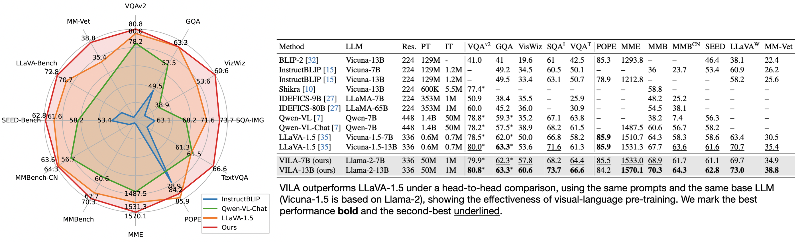
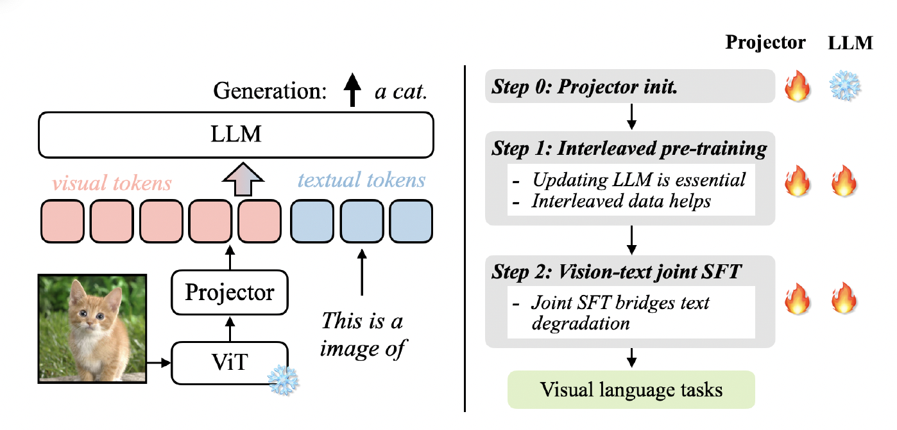
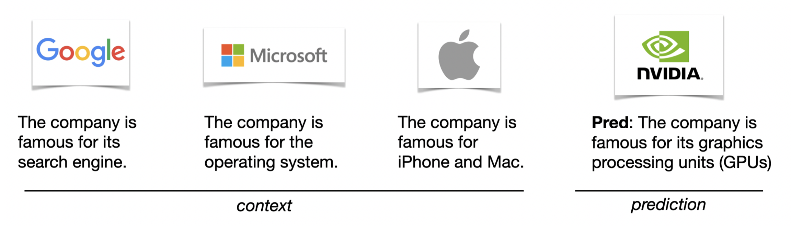

# VILA: Visual Language Model (NVIDIA Internal Repository)
[[Paper](https://drive.google.com/file/d/1wyjEgVNZkU30PBP9sSMaw_ZIwJC9TVc-/view)][[Slides](https://drive.google.com/file/d/1InYfsXRY8q5QVVdo8VGgrDpSrPOg8b2G/view)]




## News
- [2023/11] We release the VILA-7B and VILA-13B model checkpoints and associated scripts.


## Abstract
**VILA** is a PaLM-E style **VI**sual **LA**nguage model that augments the LLM with visual token. VILA outperforms state-of-the-art model, LLaVA-1.5. We introduce three main findings: (1) unfreezing LLM during pre-training enables in-context learning capability; (2) interleaved pre-training data is beneficial whereas image-text pairs alone are not optimal; (3) re-blending text-only instruction data to image-text data during instruction fine-tuning not only remedies the degradation of text-only tasks, but also boosts VLM task accuracy. Multi-modal pre-training unveil appealing properties of VILA, including multi-image reasoning, enhanced in-context learning, and better world knowledge.



## Installation

### Repository
```bash
mkdir ~/workspace
cd ~/workspace
git clone ssh://git@gitlab-master.nvidia.com:12051/dler/multi-modality-research.git
cd multi-modality-research/VILA
```

### Packages
```bash
conda create -n vila python=3.10 -y
conda activate vila

pip install --upgrade pip  # enable PEP 660 support
pip install -e .

conda install -c nvidia cuda-toolkit

pip install pytorchvideo
pip install decord
pip install datasets
pip install scikit-learn
pip install openai
pip install webdataset

pip install ninja
pip install flash-attn --no-build-isolation

pip install git+https://github.com/huggingface/transformers@v4.36.2
cp -r ~/workspace/multi-modality-research/VILA/llava/train/transformers_replace/* ~/anaconda3/envs/vila/lib/python3.10/site-packages/transformers/models/
```

## Usage

### Live Demo Interface.

We host an demo on [http://omniml-a4.nvidia.com:7860/](http://omniml-a4.nvidia.com:7860/). 
Note this is currently under construction and may change in the future. 

### Pretrained VILA-7B and VILA-13B weights.
 [Pretrained weights (root folder for 7B and 13B)](https://drive.google.com/file/d/1hFAW1LqC9TRHJt9kkjVeKOLhv1HuzhQi/view?usp=sharing)

 A more performant Vicuna-13B model is also available on `draco-oci-iad` at `/home/jasonlu/llava/checkpoints/vicuna-13b-clip336-mmc4sub+coyo-finetune-llava15+vflan+sharegpt4v-nosqa-linear-e2`
 The config of these models need to change a bit due to the latest change of the code. You can use `convert_ckpt.py`.

Please download and unzip the file into a folder `multi-modality-research/VILA/checkpoints` as:

On selene, the checkpoints are stored at 
`/home/scratch.ligengz_gpu/ligeng/Downloads`


```bash
  multi-modality-research
  ├── VILA
      ├── checkpoints
          ├── vila-7B
          ├── vila-13B
```

### Inference.

We provide snippets for quick inference with user prompts and images.

VILA-7B inference:
```bash
cd multi-modality-research/VILA
python -W ignore llava/eval/run_llava.py \
--model-name checkpoints/vila-7B \
--conv-mode vicuna_v1_1 \
--query "<image>\n Please describe the traffic condition." \
--image-file "demo_images/av.png"
```

VILA-13B inference:
```bash
cd multi-modality-research/VILA
python -W ignore llava/eval/run_llava.py \
--model-name checkpoints/vila-13B \
--conv-mode vicuna_v1_1 \
--query "<image>\n Please describe the traffic condition." \
--image-file "demo_images/av.png"
```

### Demo

**Logic Reasoning**


```bash
cd multi-modality-research/VILA
python -W ignore llava/eval/run_llava.py \
--model-name checkpoints/vila-13B \
--conv-mode vicuna_v1_1 \
--query "Photo: <image>\n Menu: <image>\n How much shall I pay for all the beer on the table according to the price on the menu? Think step-by-step. " \
--image-file "demo_images/menu/menu1.png###demo_images/menu/menu2.png"
```

**In-context Learning**



```bash
cd multi-modality-research/VILA
python -W ignore llava/eval/run_llava.py \
--model-name checkpoints/vila-13B \
--conv-mode vicuna_v1_1 \
--query "<image>\n###The company is famous for its search engine.###<image>\n###The company is famous for the operating system.###<image>\n###The company is famous for iPhone and Mac.###<image>\n " \
--image-file "demo_images/icl-logo/google.webp###demo_images/icl-logo/microsoft.jpg###demo_images/icl-logo/apple.jpg###demo_images/icl-logo/nvidia.png"
```

**Synthesized Image Analysis**


```bash
cd multi-modality-research/VILA
python -W ignore llava/eval/run_llava.py \
--model-name checkpoints/vila-13B \
--conv-mode vicuna_v1_1 \
--query "<image>\n Describe this image in details. " \
--image-file "demo_images/dalle_potatoking.jpeg"
```


We will provide more demo snippets soon.

## Training

### Wandb
Register a wandb.ai account.
Run test script such as: scripts/llama2/336/pretrain_ccs_llama_test.sh
it will ask you to login.

### Step 0 - Train Projector
See `scripts/paper/0_train_projector.sh`

### Step 1 - Pretraining
See `scripts/paper/1_train_mmc4_coyo.sh`

### Step 2 - SFT
See `scripts/paper/2_sft.sh`

## Eval
For image evals, you can follow [Llava1.5 eval](https://github.com/haotian-liu/LLaVA/blob/main/docs/Evaluation.md) or you can copy `/home/jasonlu/llava/playground/data/eval` to `./playground/data/eval` on draco and then see `scripts/eval/llava15` to run evaluations.

For video evals, you can follow [video llava](https://github.com/PKU-YuanGroup/Video-LLaVA/blob/main/TRAIN_AND_VALIDATE.md) or you can copy `/home/jasonlu/workspace/multi-modality-research/VILA/eval/GPT_Zero_Shot_QA` to `./eval/GPT_Zero_Shot_QA` on draco and then see `scripts/eval/video_chatgpt/` to run evaluations.

### Evaluation Server
[VQAv2](https://eval.ai/web/challenges/challenge-page/830/my-submission) and [Vizwiz](https://eval.ai/web/challenges/challenge-page/1911/my-submission) eval are hosted on eval.ai. You need to register an account and create a team to be able to submit eval.

MMBench and MMBench_CN eval are also hosted on another [evaluation server](https://opencompass.org.cn/leaderboard-multimodal). Make sure you change the name of the file before submitting, otherwise the server caches results and will always return wrong result to you.
